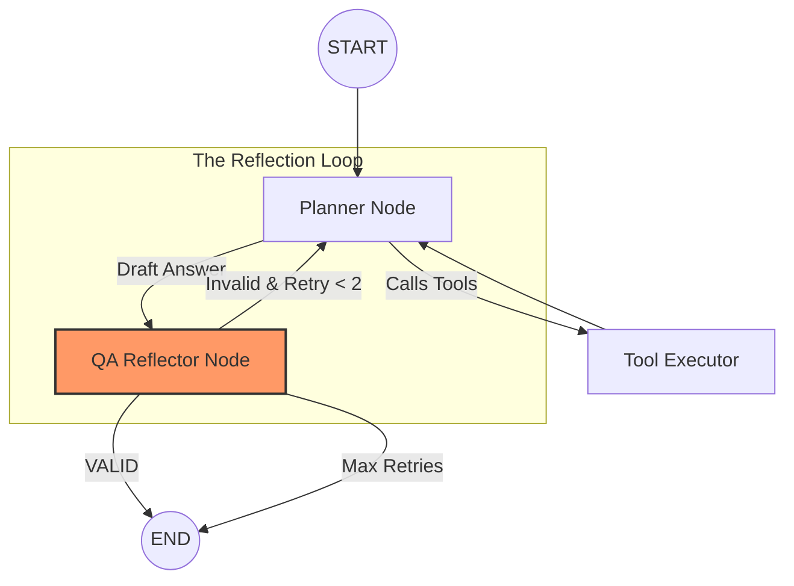

# Agent Architecture — Staged Planning & Reflection

This document details the internal logic of the TravelAI brain, specifically focusing on how the system manages the multi-turn planning lifecycle and the differences between the LangChain and LangGraph implementations.

## 🧭 The Planning Lifecycle
Both agents adhere to a strictly staged flow to ensure a high-quality "concierge" experience.

1.  **Initial**: Information gathering (Budget, Dates, Group Size, Loyalty Memberships).
2.  **Flights**: Multimodal transport research (Trains/Buses for short trips, Flights for long).
3.  **Hotels**: Accommodation curation and proximity analysis.
4.  **Attractions**: Day-by-day itinerary build-out with user approval loops.
5.  **Complete**: Full JSON generation with geocoding and timing buffers.

---

## 🤖 Engine 1: LangChain (Linear Reasoning)
The LangChain implementation uses a single, high-context prompt (`MAIN_SYSTEM_PROMPT`) to simulate a state machine.
- **State Management**: The agent looks at the current `PlanningSession` stage (stored in PostgreSQL) and previous interaction history to decide which set of rules to follow.
- **Tagging**: It emits `<planning_stage>` tags at the end of every response to signal state transitions to the backend.

---

## 🏗️ Engine 2: LangGraph (Stateful Reflection)
The LangGraph implementation is a more sophisticated, self-correcting graph that enforces quality through a **Planner-Reflector-Executor** architecture.

### 1. Planner Node
The main reasoning engine. It selects a **Stage-Specific Duty** (e.g., `FLIGHT_AGENT_PROMPT`) and generates either tool calls or a draft response. It is the only node that streams tokens to the user.

### 2. Tool Executor (The Hands)
A dedicated node that handles all external I/O (RAG, Weather, Flights). Tool outputs are fed back into the Planner's memory for the next turn.

### 3. QA Reflector (The Critic)
Before a response is finalized, the **Reflector** node evaluates it against strict standards:
- **Concierge Test**: Did the planner skip a stage or get too "idealistic"?
- **Grounding Test**: Did it check the current date/weather?
- **Feedback**: If valid, the graph ends. If invalid, the Reflector provides specific feedback (e.g., "You suggested a flight for a 200km trip; suggest a train instead"), forcing the Planner to try again.

---

## 🧠 Tool & Knowledge Integration
- **RAG (Knowledge First)**: The system is designed with a "RAG-First" policy. `rag_travel_knowledge` is called before any external search to save latency and costs.
- **Temporal Grounding**: Every session begins with a mandatory `get_current_time` call. This prevents the "GPT-4 date cutoff" issue, ensuring the agent knows it's currently April and plans seasonally appropriate activities.
- **Structured Output**: Final itineraries are parsed and validated into the `ChatItinerary` model, allowing the frontend to render maps and timelines with high fidelity.

---
*Created by Antigravity AI*
