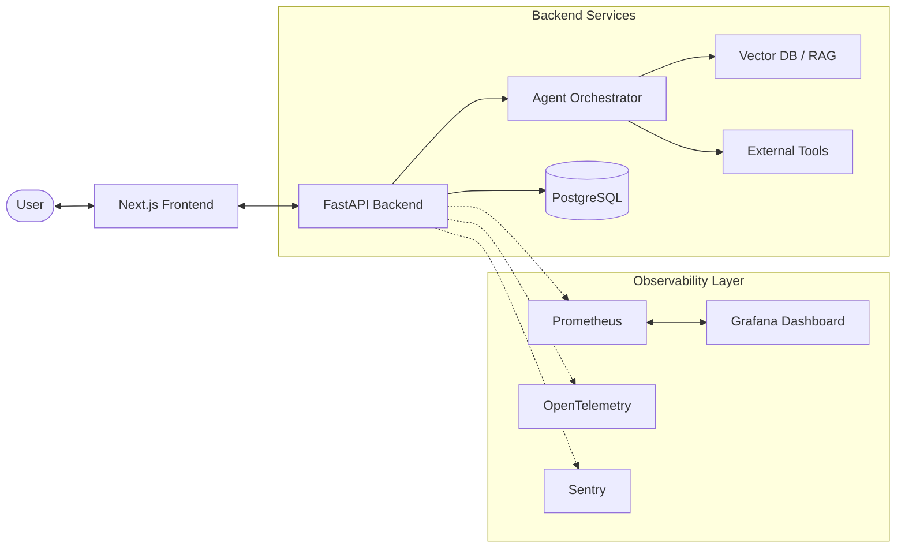

# System Architecture — TravelAI

This document provides a high-level overview of the TravelAI ecosystem, detailing the communication flow between the frontend and backend, the selection of agentic engines, and the comprehensive observability stack.

## 🏗️ Overall Stack
The system is built on a modern, distributed architecture designed for low-latency AI interactions and high observability.

---

## 🛰️ Frontend-Backend Communication
The interface communicates with the backend via a RESTful API, utilizing **Server-Sent Events (SSE)** for real-time token streaming and tool-call updates.

### Request Payload
When a user sends a message, the frontend POSTs to `/api/v1/messages/`:
- `chat_room_id`: UUID for session persistence.
- `content`: The user's query.
- `agent_mode`: "langchain" or "langgraph" (user-selectable).

### Response Streaming
The backend yields a stream of:
1.  **Plain Text**: Real-time LLM tokens.
2.  **Tool Markers**: `[STEP:Searching flights...]` to update the UI's progress indicators dynamically.
3.  **JSON Blocks**: Structured `<itinerary>` data for the right-hand side panel.

---

## 🛠️ Infrastructure & Data
- **Persistence**: Relational data (Users, Chats, Messages, Itineraries) is stored in **PostgreSQL** using SQLAlchemy for async ORM.
- **Knowledge**: The RAG system (`rag_travel_knowledge`) uses a semantic vector store to provide the agent with pre-indexed travel facts, reducing external API calls.
- **Tooling**: A suite of tools covers Geocoding, OpenMeteo (Weather), Skyscanner/Firecrawl (Flights/Hotels), and Google Places.

---

## 📊 Observability & Monitoring
A core pillar of the project is the **`chatbot-observability`** stack, which provides a full-loop view of system health.

### 1. Prometheus & Metrics
The backend exposes a `/metrics` endpoint. The `metrics_middleware` automatically captures:
- `http_requests_total`: Grouped by method, path, and status code.
- `http_request_duration_seconds`: Latency percentiles.
- **Node Exporter & Prometheus**: Configured in the `chatbot-observability` repo to scrape these metrics and visualize them in custom **Grafana** dashboards.

### 2. OpenTelemetry & Tracing
Every request is instrumented with **OpenTelemetry**. Traces include:
- Request ID propagation (X-Request-ID).
- Spans for LLM calls, tool executions, and database queries.
- Visualization via **Jeager** for pinpointing latency bottlenecks.

### 3. Structured Logging
The system uses `app.core.logging` to emit JSON-formatted logs.
- **Metadata**: Every log includes `request_id`, `chat_id`, and `thread_name`.
- **Error Tracking**: `logger.exception()` captures full stack traces, which are also mirrored to **Sentry** for real-time alerting.

---
*Created by Antigravity AI*
